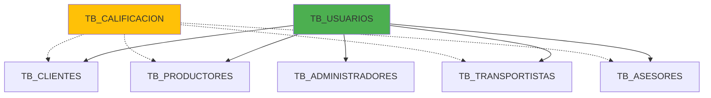
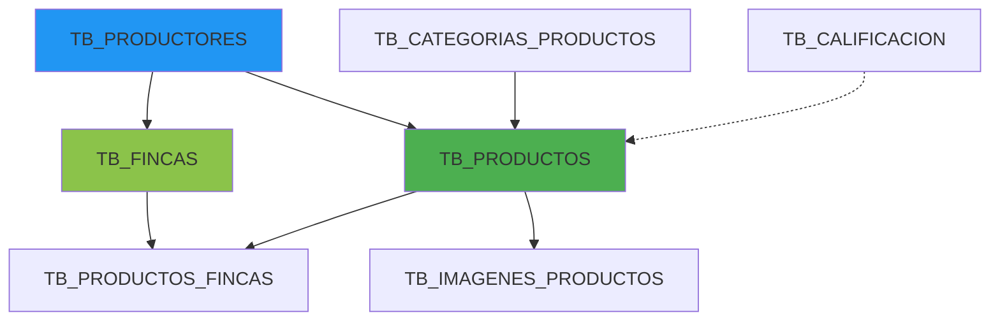
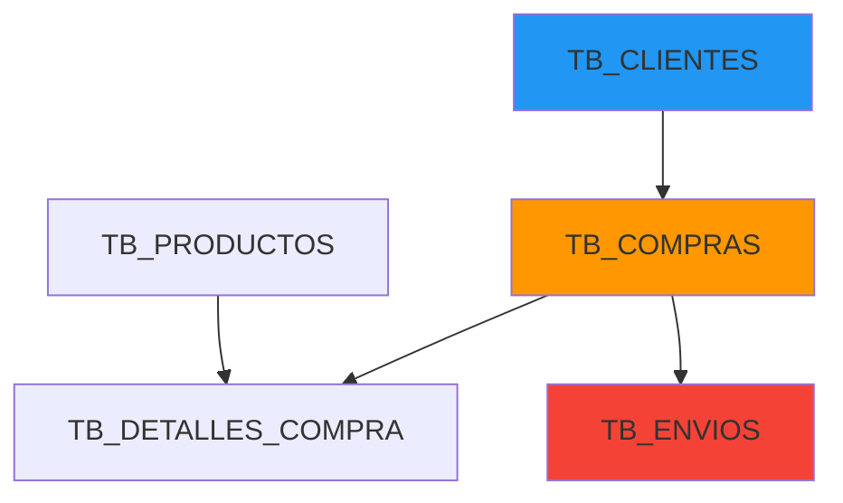
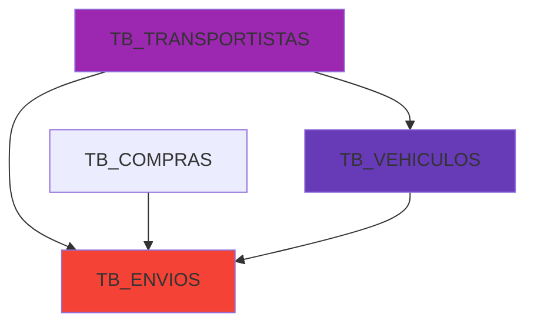
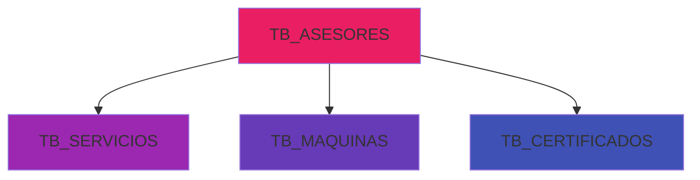

# 🎨 DIAGRAMA ENTIDAD-RELACIÓN COMPLETO - AGROLINK

## Diagrama Mermaid (Visual)

```mermaid
erDiagram
    %% TABLA PRINCIPAL
    TB_USUARIOS {
        int id_usuario PK
        varchar nombre
        varchar nombre_usuario UK
        varchar contrasena_usuario
        varchar apellido
        varchar correo UK
        varchar ciudad
        varchar departamento
        varchar direccion
        varchar cedula UK
        varchar telefono
        varchar rol
        double latitud
        double longitud
    }
    
    %% TABLA DE CALIFICACIONES
    TB_CALIFICACION {
        int id_calificacion PK
        decimal puntaje
        decimal promedio
    }
    
    %% ESPECIALIZACIONES DE USUARIO
    TB_CLIENTES {
        int id_usuario PK_FK
        int id_calificacion FK
        varchar preferencias
    }
    
    TB_PRODUCTORES {
        int id_usuario PK_FK
        int id_calificacion FK
        varchar tipo_cultivo
    }
    
    TB_TRANSPORTISTAS {
        int id_usuario PK_FK
        int id_calificacion FK
        varchar zonas_entrega
    }
    
    TB_ASESORES {
        int id_usuario PK_FK
        int id_calificacion FK
        varchar tipo_asesoria
    }
    
    TB_ADMINISTRADORES {
        int id_usuario PK_FK
        varchar privilegios_admin
    }
    
    %% FINCAS Y PRODUCTOS
    TB_FINCAS {
        int id_finca PK
        int id_usuario FK
        varchar nombre_finca
        varchar direccion_finca
        varchar certificado_BPA
        varchar certificado_MIRFE
        varchar certificado_MIPE
        varchar registro_ICA
        double latitud
        double longitud
        varchar ciudad
        varchar departamento
    }
    
    TB_CATEGORIAS_PRODUCTOS {
        int id_categoria PK
        varchar nombre_categoria
    }
    
    TB_PRODUCTOS {
        int id_producto PK
        int id_usuario FK
        int id_categoria FK
        int id_calificacion FK
        decimal precio
        varchar nombre_producto
        varchar descripcion_producto
        int stock
        decimal peso_kg
    }
    
    TB_IMAGENES_PRODUCTOS {
        int id_imagen PK
        int id_producto FK
        varchar url_imagen
        boolean es_principal
    }
    
    TB_PRODUCTOS_FINCAS {
        int id_producto_finca PK
        int id_finca FK
        int id_producto FK
        decimal cantidad_produccion
        date fecha_cosecha
    }
    
    %% COMPRAS Y DETALLES
    TB_COMPRAS {
        int id_compra PK
        int id_cliente FK
        datetime fecha_hora_compra
        decimal subtotal
        decimal impuestos
        decimal valor_envio
        decimal total
        varchar direccion_entrega
        varchar metodo_pago
    }
    
    TB_DETALLES_COMPRA {
        int id_detalle PK
        int id_compra FK
        int id_producto FK
        int cantidad
        decimal precio_unitario
        decimal subtotal
    }
    
    %% TRANSPORTE
    TB_VEHICULOS {
        int id_vehiculo PK
        int id_transportista FK
        varchar tipo_vehiculo
        decimal capacidad_carga
        varchar documento_propiedad
        varchar placa_vehiculo
    }
    
    TB_ENVIOS {
        int id_envio PK
        int id_compra FK
        int id_vehiculo FK
        int id_transportista FK
        varchar estado_envio
        date fecha_salida
        date fecha_entrega
        varchar numero_seguimiento
        varchar direccion_origen
        varchar direccion_destino
        double latitud_origen
        double longitud_origen
        double latitud_destino
        double longitud_destino
        double distancia_km
        double peso_total_kg
        decimal costo_base
        decimal costo_peso
        decimal costo_total
        decimal tarifa_por_km
        decimal tarifa_por_kg
    }
    
    %% SERVICIOS Y ASESORES
    TB_SERVICIOS {
        int id_servicio PK
        int id_asesor FK
        varchar descripcion
        varchar estado
    }
    
    TB_MAQUINAS {
        int id_maquina PK
        int id_asesor FK
        varchar tipo_maquina
        varchar documento_propiedad
        varchar modelo
        varchar registro_RNMA
        varchar tarjeta_registro_maquinaria
    }
    
    TB_CERTIFICADOS {
        int id_certificado PK
        int id_usuario FK
        varchar tipo_certificado
        varchar descripcion_cert
        date fecha_expedicion
    }
    
    %% RELACIONES USUARIO
    TB_USUARIOS ||--o| TB_CLIENTES : "es"
    TB_USUARIOS ||--o| TB_PRODUCTORES : "es"
    TB_USUARIOS ||--o| TB_TRANSPORTISTAS : "es"
    TB_USUARIOS ||--o| TB_ASESORES : "es"
    TB_USUARIOS ||--o| TB_ADMINISTRADORES : "es"
    
    %% RELACIONES CALIFICACION
    TB_CALIFICACION ||--o{ TB_CLIENTES : "tiene"
    TB_CALIFICACION ||--o{ TB_PRODUCTORES : "tiene"
    TB_CALIFICACION ||--o{ TB_TRANSPORTISTAS : "tiene"
    TB_CALIFICACION ||--o{ TB_ASESORES : "tiene"
    TB_CALIFICACION ||--o{ TB_PRODUCTOS : "tiene"
    
    %% RELACIONES PRODUCTOR
    TB_PRODUCTORES ||--o{ TB_FINCAS : "posee"
    TB_PRODUCTORES ||--o{ TB_PRODUCTOS : "vende"
    
    %% RELACIONES FINCA-PRODUCTO
    TB_FINCAS ||--o{ TB_PRODUCTOS_FINCAS : "cultiva"
    TB_PRODUCTOS ||--o{ TB_PRODUCTOS_FINCAS : "se_produce_en"
    
    %% RELACIONES PRODUCTO
    TB_CATEGORIAS_PRODUCTOS ||--o{ TB_PRODUCTOS : "clasifica"
    TB_PRODUCTOS ||--o{ TB_IMAGENES_PRODUCTOS : "tiene"
    
    %% RELACIONES COMPRA
    TB_CLIENTES ||--o{ TB_COMPRAS : "realiza"
    TB_COMPRAS ||--o{ TB_DETALLES_COMPRA : "contiene"
    TB_PRODUCTOS ||--o{ TB_DETALLES_COMPRA : "incluye"
    
    %% RELACIONES ENVIO
    TB_COMPRAS ||--o| TB_ENVIOS : "genera"
    TB_TRANSPORTISTAS ||--o{ TB_ENVIOS : "realiza"
    TB_VEHICULOS ||--o{ TB_ENVIOS : "transporta"
    TB_TRANSPORTISTAS ||--o{ TB_VEHICULOS : "posee"
    
    %% RELACIONES ASESOR
    TB_ASESORES ||--o{ TB_SERVICIOS : "ofrece"
    TB_ASESORES ||--o{ TB_MAQUINAS : "posee"
    TB_ASESORES ||--o{ TB_CERTIFICADOS : "tiene"
```

---

## 📊 DIAGRAMA SIMPLIFICADO POR MÓDULOS

### 🔵 MÓDULO DE USUARIOS Y AUTENTICACIÓN



### 🟢 MÓDULO DE PRODUCTOS Y FINCAS



### 🟡 MÓDULO DE COMERCIO Y VENTAS



### 🔴 MÓDULO DE LOGÍSTICA Y TRANSPORTE



### 🟣 MÓDULO DE ASESORÍAS Y SERVICIOS



---

## 🔗 CARDINALIDADES DETALLADAS

### Relaciones 1:1 (Uno a Uno)
| Tabla Padre | Tabla Hija | Descripción |
|-------------|-----------|-------------|
| TB_USUARIOS | TB_CLIENTES | Un usuario puede ser un cliente |
| TB_USUARIOS | TB_PRODUCTORES | Un usuario puede ser un productor |
| TB_USUARIOS | TB_TRANSPORTISTAS | Un usuario puede ser un transportista |
| TB_USUARIOS | TB_ASESORES | Un usuario puede ser un asesor |
| TB_USUARIOS | TB_ADMINISTRADORES | Un usuario puede ser un administrador |
| TB_COMPRAS | TB_ENVIOS | Una compra genera un envío |

### Relaciones 1:N (Uno a Muchos)
| Tabla Uno | Tabla Muchos | Descripción |
|-----------|-------------|-------------|
| TB_CALIFICACION | TB_CLIENTES | Una calificación puede tener muchos clientes |
| TB_CALIFICACION | TB_PRODUCTORES | Una calificación puede tener muchos productores |
| TB_CALIFICACION | TB_PRODUCTOS | Una calificación puede tener muchos productos |
| TB_PRODUCTORES | TB_FINCAS | Un productor puede tener muchas fincas |
| TB_PRODUCTORES | TB_PRODUCTOS | Un productor puede vender muchos productos |
| TB_CATEGORIAS_PRODUCTOS | TB_PRODUCTOS | Una categoría agrupa muchos productos |
| TB_PRODUCTOS | TB_IMAGENES_PRODUCTOS | Un producto puede tener muchas imágenes |
| TB_CLIENTES | TB_COMPRAS | Un cliente puede realizar muchas compras |
| TB_COMPRAS | TB_DETALLES_COMPRA | Una compra contiene muchos detalles |
| TB_PRODUCTOS | TB_DETALLES_COMPRA | Un producto puede estar en muchos detalles |
| TB_TRANSPORTISTAS | TB_VEHICULOS | Un transportista puede tener muchos vehículos |
| TB_TRANSPORTISTAS | TB_ENVIOS | Un transportista puede realizar muchos envíos |
| TB_VEHICULOS | TB_ENVIOS | Un vehículo puede realizar muchos envíos |
| TB_ASESORES | TB_SERVICIOS | Un asesor puede ofrecer muchos servicios |
| TB_ASESORES | TB_MAQUINAS | Un asesor puede tener muchas máquinas |
| TB_ASESORES | TB_CERTIFICADOS | Un asesor puede tener muchos certificados |

### Relaciones N:M (Muchos a Muchos)
| Tabla 1 | Tabla Intermedia | Tabla 2 | Descripción |
|---------|------------------|---------|-------------|
| TB_FINCAS | TB_PRODUCTOS_FINCAS | TB_PRODUCTOS | Una finca cultiva muchos productos, un producto se cultiva en muchas fincas |

---

## 📈 FLUJOS DE DATOS PRINCIPALES

### 1. Flujo de Registro de Usuario
```
Usuario Ingresa Datos
    ↓
INSERT en TB_USUARIOS
    ↓
Según ROL seleccionado:
    ├─ CLIENTE → INSERT en TB_CLIENTES
    ├─ PRODUCTOR → INSERT en TB_PRODUCTORES
    ├─ TRANSPORTISTA → INSERT en TB_TRANSPORTISTAS
    ├─ ASESOR → INSERT en TB_ASESORES
    └─ ADMIN → INSERT en TB_ADMINISTRADORES
```

### 2. Flujo de Creación de Producto
```
Productor crea producto
    ↓
SELECT TB_PRODUCTORES (validar productor)
    ↓
INSERT en TB_PRODUCTOS
    ↓
Upload imágenes → INSERT en TB_IMAGENES_PRODUCTOS
    ↓
Asociar finca → INSERT en TB_PRODUCTOS_FINCAS
```

### 3. Flujo de Compra
```
Cliente selecciona productos
    ↓
Agregar al carrito (sesión)
    ↓
Confirmar compra
    ↓
BEGIN TRANSACTION
    ├─ INSERT en TB_COMPRAS
    ├─ INSERT múltiple en TB_DETALLES_COMPRA
    ├─ UPDATE TB_PRODUCTOS (reducir stock)
    └─ COMMIT
    ↓
Crear envío → INSERT en TB_ENVIOS
    ↓
Calcular costo con GPS
```

### 4. Flujo de Envío
```
Compra creada
    ↓
INSERT en TB_ENVIOS (estado: Buscando_Transporte)
    ↓
Transportista acepta
    ↓
UPDATE TB_ENVIOS (asignar transportista y vehículo)
    ↓
UPDATE estado → En_Camino
    ↓
Rastreo con GPS
    ↓
UPDATE estado → Entregado
```

---

## 🎯 CONSULTAS SQL FRECUENTES

### Obtener todos los productos de un productor
```sql
SELECT p.*, u.nombre AS productor_nombre
FROM tb_productos p
INNER JOIN tb_productores prod ON p.id_usuario = prod.id_usuario
INNER JOIN tb_usuarios u ON prod.id_usuario = u.id_usuario
WHERE prod.id_usuario = ?;
```

### Obtener compras de un cliente con detalles
```sql
SELECT 
    c.id_compra,
    c.fecha_hora_compra,
    c.total,
    dc.cantidad,
    dc.precio_unitario,
    p.nombre_producto
FROM tb_compras c
INNER JOIN tb_detalles_compra dc ON c.id_compra = dc.id_compra
INNER JOIN tb_productos p ON dc.id_producto = p.id_producto
WHERE c.id_cliente = ?
ORDER BY c.fecha_hora_compra DESC;
```

### Calcular distancia y costo de envío
```sql
SELECT 
    e.*,
    (e.distancia_km * e.tarifa_por_km) AS costo_distancia,
    (e.peso_total_kg * e.tarifa_por_kg) AS costo_peso,
    ((e.distancia_km * e.tarifa_por_km) + (e.peso_total_kg * e.tarifa_por_kg)) AS costo_total_calculado
FROM tb_envios e
WHERE e.id_envio = ?;
```

### Productos con bajo stock
```sql
SELECT 
    p.id_producto,
    p.nombre_producto,
    p.stock,
    u.nombre AS productor_nombre,
    u.telefono AS productor_telefono
FROM tb_productos p
INNER JOIN tb_productores prod ON p.id_usuario = prod.id_usuario
INNER JOIN tb_usuarios u ON prod.id_usuario = u.id_usuario
WHERE p.stock < 10
ORDER BY p.stock ASC;
```

### Ranking de productores por ventas
```sql
SELECT 
    u.nombre,
    u.apellido,
    COUNT(DISTINCT dc.id_compra) AS total_ventas,
    SUM(dc.subtotal) AS total_facturado
FROM tb_productos p
INNER JOIN tb_detalles_compra dc ON p.id_producto = dc.id_producto
INNER JOIN tb_productores prod ON p.id_usuario = prod.id_usuario
INNER JOIN tb_usuarios u ON prod.id_usuario = u.id_usuario
GROUP BY u.id_usuario
ORDER BY total_facturado DESC;
```

---

## 🔍 ÍNDICES RECOMENDADOS ADICIONALES

```sql
-- Índice compuesto para búsqueda de productos por categoría y stock
CREATE INDEX idx_producto_categoria_stock 
ON tb_productos(id_categoria, stock);

-- Índice para búsqueda de fincas por ubicación
CREATE INDEX idx_finca_ciudad_departamento 
ON tb_fincas(ciudad, departamento);

-- Índice para tracking de envíos
CREATE INDEX idx_envio_tracking 
ON tb_envios(numero_seguimiento, estado_envio);

-- Índice para búsqueda de usuarios por ciudad
CREATE INDEX idx_usuario_ubicacion 
ON tb_usuarios(ciudad, departamento);

-- Índice para imágenes principales
CREATE INDEX idx_imagen_principal_producto 
ON tb_imagenes_productos(id_producto, es_principal);
```

---

## 📱 COMPATIBILIDAD CON ORM (JPA/Hibernate)

La base de datos está completamente compatible con:
- ✅ Spring Boot JPA
- ✅ Hibernate 6.x
- ✅ Jakarta Persistence API
- ✅ Lazy/Eager Loading
- ✅ Cascade Operations
- ✅ Bidirectional Relationships

---

## 🌐 INTEGRACIÓN CON APIs EXTERNAS

### Google Maps API
- Utilizada para obtener coordenadas GPS (Geocoding)
- Cálculo de distancias reales (Distance Matrix API)
- Visualización de rutas de envío

### Pasarelas de Pago
- Campo `metodo_pago` en TB_COMPRAS
- Integración con: MercadoPago, PayU, Stripe

---

**Generado:** 2025-12-11  
**Herramienta:** Mermaid Diagrams + Markdown  
**Proyecto:** Agrolink - Sistema de Comercialización Agrícola

