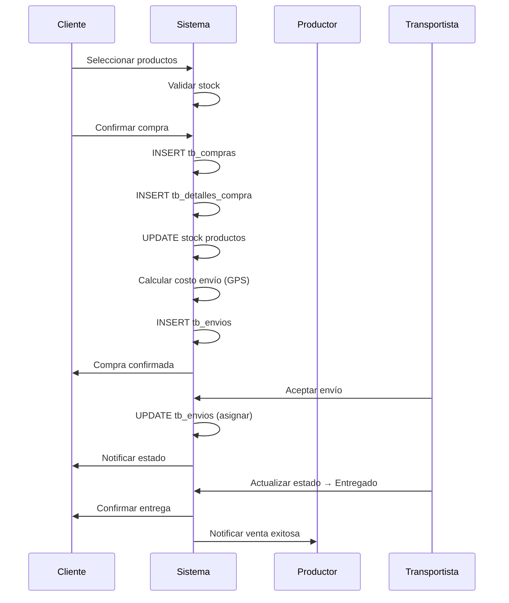

# 📦 RESUMEN EJECUTIVO - BASE DE DATOS AGROLINK

## ✅ ARCHIVOS GENERADOS

He creado un paquete completo de documentación y scripts para la base de datos Agrolink:

### 1️⃣ Script_BD_Completo_Agrolink.sql
**📄 Archivo:** `Script_BD_Completo_Agrolink.sql`  
**📝 Descripción:** Script SQL completo y ejecutable para MySQL 8.0+

**Contenido:**
- ✅ Creación de base de datos `db_agrolink`
- ✅ 19 tablas con todas sus relaciones
- ✅ Claves primarias y foráneas
- ✅ Índices optimizados
- ✅ Datos de prueba completos:
  - 1 Administrador
  - 3 Productores con fincas
  - 2 Clientes
  - 1 Transportista con 2 vehículos
  - 1 Asesor con servicios y maquinaria
  - 5 Productos con imágenes
  - 1 Compra completa con envío
- ✅ 3 Vistas útiles
- ✅ 1 Procedimiento almacenado
- ✅ 3 Triggers automáticos

**Uso:**
```bash
mysql -u root -p < Script_BD_Completo_Agrolink.sql
```

---

### 2️⃣ DOCUMENTACION_BASE_DATOS.md
**📄 Archivo:** `DOCUMENTACION_BASE_DATOS.md`  
**📝 Descripción:** Documentación técnica detallada en formato Markdown

**Contenido:**
- 📊 Descripción de cada tabla (19 tablas)
- 🔗 Explicación de todas las relaciones
- 📈 Vistas disponibles
- ⚙️ Procedimientos almacenados
- 🔧 Triggers implementados
- 🌍 Sistema de geolocalización con GPS
- 🔐 Seguridad y roles
- 💾 Datos iniciales
- 📝 Notas importantes

---

### 3️⃣ DIAGRAMA_ER_COMPLETO.md
**📄 Archivo:** `DIAGRAMA_ER_COMPLETO.md`  
**📝 Descripción:** Diagramas visuales en formato Mermaid

**Contenido:**
- 🎨 Diagrama Entidad-Relación completo
- 📊 Diagramas por módulos:
  - 🔵 Módulo de Usuarios
  - 🟢 Módulo de Productos y Fincas
  - 🟡 Módulo de Comercio
  - 🔴 Módulo de Logística
  - 🟣 Módulo de Asesorías
- 🔗 Tabla de cardinalidades
- 📈 Flujos de datos
- 🎯 Consultas SQL frecuentes
- 🔍 Índices recomendados

---

## 🗂️ ESTRUCTURA DE LA BASE DE DATOS

### Resumen General
```
📊 Base de Datos: db_agrolink
├── 19 Tablas
│   ├── 1 Tabla principal (tb_usuarios)
│   ├── 5 Tablas de especialización de usuario
│   ├── 1 Tabla de calificaciones
│   ├── 4 Tablas de productos y fincas
│   ├── 3 Tablas de comercio
│   ├── 3 Tablas de logística
│   └── 2 Tablas de asesorías
├── 3 Vistas
├── 1 Procedimiento Almacenado
└── 3 Triggers
```

---

## 📋 TABLAS PRINCIPALES

### Tabla Central: tb_usuarios
**Propósito:** Gestiona todos los usuarios del sistema  
**Campos clave:** 
- Autenticación: nombre_usuario, contrasena_usuario
- Datos personales: nombre, apellido, correo, cedula
- Ubicación: ciudad, departamento, direccion
- Geolocalización: latitud, longitud
- Rol: rol (ROLE_ADMIN, ROLE_CLIENTE, ROLE_PRODUCTOR, ROLE_TRANSPORTISTA, ROLE_ASESOR)

**Especializaciones (1:1):**
1. **tb_clientes** - Compradores de productos
2. **tb_productores** - Vendedores agrícolas (1:N con fincas y productos)
3. **tb_transportistas** - Realizan entregas (1:N con vehículos)
4. **tb_asesores** - Ofrecen servicios técnicos
5. **tb_administradores** - Gestionan el sistema

---

### Módulo de Productos
```
tb_productores (Productor)
    ├── tb_fincas (Fincas del productor)
    │   └── tb_productos_fincas (Asociación N:M)
    └── tb_productos (Productos a la venta)
        ├── tb_imagenes_productos (Imágenes)
        └── tb_categorias_productos (Categorización)
```

**Características:**
- ✅ Sistema de stock automático
- ✅ Múltiples imágenes por producto
- ✅ Calificación de productos
- ✅ Trazabilidad (producto → finca → productor)
- ✅ Peso en kg para cálculo de envío

---

### Módulo de Comercio
```
tb_clientes
    └── tb_compras
        ├── tb_detalles_compra (productos de la compra)
        └── tb_envios (gestión de entrega)
```

**Características:**
- ✅ Cálculo automático de subtotal, impuestos y total
- ✅ Validación de stock antes de compra (trigger)
- ✅ Historial completo de compras
- ✅ Múltiples métodos de pago

---

### Módulo de Logística
```
tb_transportistas
    ├── tb_vehiculos (flota de transporte)
    └── tb_envios
        ├── id_compra (compra asociada)
        ├── id_vehiculo (vehículo asignado)
        └── Coordenadas GPS (origen/destino)
```

**Sistema de Geolocalización:**
- 📍 Latitud/Longitud en: usuarios, fincas, envíos
- 📏 Cálculo de distancia con fórmula Haversine
- 💰 Costo automático: 
  - Base: $2,500 COP/km
  - Peso: $50 COP/kg
  - Total = (distancia × $2,500) + (peso × $50)

---

### Módulo de Asesorías
```
tb_asesores
    ├── tb_servicios (servicios ofrecidos)
    ├── tb_maquinas (maquinaria disponible)
    └── tb_certificados (certificaciones profesionales)
```

---

## 🔗 RELACIONES CLAVE

### Relaciones 1:1 (Herencia)
- Usuario → Cliente
- Usuario → Productor
- Usuario → Transportista
- Usuario → Asesor
- Usuario → Administrador
- Compra → Envío

### Relaciones 1:N (Uno a Muchos)
- Productor → Fincas (1:N)
- Productor → Productos (1:N)
- Cliente → Compras (1:N)
- Compra → Detalles (1:N)
- Transportista → Vehículos (1:N)
- Transportista → Envíos (1:N)
- Producto → Imágenes (1:N)

### Relaciones N:M (Muchos a Muchos)
- Finca ↔ Producto (a través de tb_productos_fincas)

---

## 🚀 CARACTERÍSTICAS AVANZADAS

### 1. Sistema de Geolocalización
```sql
-- Campos GPS en múltiples tablas
tb_usuarios: latitud, longitud
tb_fincas: latitud, longitud
tb_envios: latitud_origen, longitud_origen, latitud_destino, longitud_destino

-- Cálculo de distancia (implementado en Java)
distancia_km = calcularDistancia(lat1, lon1, lat2, lon2)
```

### 2. Cálculo Automático de Costos
```sql
-- En tb_envios
costo_base = distancia_km × tarifa_por_km (default: $2,500)
costo_peso = peso_total_kg × tarifa_por_kg (default: $50)
costo_total = costo_base + costo_peso
```

### 3. Validación de Stock
```sql
-- Trigger: trg_validar_stock
-- Se ejecuta BEFORE INSERT en tb_detalles_compra
-- Valida que stock >= cantidad solicitada
```

### 4. Procedimiento de Compra
```sql
CALL sp_registrar_compra(
    id_cliente,
    direccion_entrega,
    metodo_pago,
    '[{"id_producto": 1, "cantidad": 3}]',
    @id_compra
);
-- Registra compra, calcula totales, actualiza stock automáticamente
```

---

## 💾 DATOS DE PRUEBA INCLUIDOS

### Usuarios Registrados
| Rol | Usuario | Email | Password |
|-----|---------|-------|----------|
| Admin | admin | admin@agrolink.com | admin |
| Productor | juan_productor | juan@agrolink.com | demo |
| Productor | maria_productora | maria@agrolink.com | demo |
| Productor | carlos_productor | carlos@agrolink.com | demo |
| Cliente | laura_cliente | laura@cliente.com | demo |
| Cliente | pedro_cliente | pedro@cliente.com | demo |
| Transportista | miguel_trans | miguel@transporte.com | demo |
| Asesor | ana_asesora | ana@asesor.com | demo |

### Productos Incluidos
1. **Tomate Chonto** - $8,500/kg (Stock: 497)
2. **Lechuga Crespa** - $3,500/kg (Stock: 295)
3. **Zanahoria** - $2,500/kg (Stock: 400)
4. **Fresa** - $12,000/kg (Stock: 198)
5. **Papa Criolla** - $4,500/kg (Stock: 600)

### Transacciones de Ejemplo
- ✅ 1 Compra completa registrada
- ✅ 3 Detalles de compra
- ✅ 1 Envío asignado con GPS
- ✅ Stock actualizado automáticamente

---

## 🔐 SEGURIDAD

### Encriptación
- Contraseñas: BCrypt con 10 rounds
- Formato: `$2a$10$...`

### Roles Implementados
- `ROLE_ADMIN` - Acceso completo
- `ROLE_CLIENTE` - Comprar productos
- `ROLE_PRODUCTOR` - Vender productos
- `ROLE_TRANSPORTISTA` - Realizar entregas
- `ROLE_ASESOR` - Ofrecer servicios

### Integridad Referencial
- ✅ ON DELETE CASCADE para limpiar datos huérfanos
- ✅ ON DELETE RESTRICT para proteger datos críticos
- ✅ UNIQUE constraints en campos clave
- ✅ NOT NULL en campos obligatorios

---

## 📊 OPTIMIZACIÓN

### Índices Implementados (20+)
- Búsqueda por rol de usuario
- Búsqueda por correo y cédula
- Búsqueda de productos por nombre, categoría, stock
- Búsqueda de compras por fecha y cliente
- Búsqueda de envíos por estado y seguimiento
- Índices de ubicación GPS

### Motor de Base de Datos
- **MySQL 8.0+**
- **InnoDB** (transacciones ACID, claves foráneas)
- **UTF-8 (utf8mb4_unicode_ci)** para caracteres especiales

---

## 🎯 CASOS DE USO PRINCIPALES

### 1. Registro de Usuario
```
POST /register
→ INSERT en tb_usuarios
→ INSERT en tb_[rol] (cliente/productor/etc.)
```

### 2. Publicación de Producto
```
POST /productos/crear
→ Validar productor
→ INSERT en tb_productos
→ INSERT en tb_imagenes_productos
→ INSERT en tb_productos_fincas
```

### 3. Realizar Compra
```
POST /compras/crear
→ BEGIN TRANSACTION
→ INSERT en tb_compras
→ INSERT múltiple en tb_detalles_compra
→ UPDATE tb_productos (stock)
→ COMMIT
→ INSERT en tb_envios
→ Calcular costo con GPS
```

### 4. Asignar Transporte
```
POST /envios/asignar
→ UPDATE tb_envios (transportista, vehículo)
→ UPDATE estado_envio = 'En_Camino'
→ Notificar cliente
```

---

## 📈 VISTAS DISPONIBLES

### 1. v_productos_completos
```sql
SELECT * FROM v_productos_completos
WHERE nombre_categoria = 'Frutas';
```
Muestra productos con información completa: categoría, productor, calificación, imagen principal.

### 2. v_compras_detalladas
```sql
SELECT * FROM v_compras_detalladas
WHERE cliente_correo = 'laura@cliente.com';
```
Compras con información del cliente y estado de envío.

### 3. v_fincas_productores
```sql
SELECT * FROM v_fincas_productores
WHERE ciudad = 'Chía';
```
Fincas con información del productor propietario.

---

## 🔄 FLUJO COMPLETO DE UNA COMPRA



---

## 📞 CONTACTO Y SOPORTE

### Archivos Generados
1. ✅ `Script_BD_Completo_Agrolink.sql` - Script ejecutable
2. ✅ `DOCUMENTACION_BASE_DATOS.md` - Documentación técnica
3. ✅ `DIAGRAMA_ER_COMPLETO.md` - Diagramas visuales
4. ✅ `RESUMEN_EJECUTIVO_BD.md` - Este archivo

### Ubicación
```
C:\ProyectoAgro_TrimestreV\springBoot_Agrolink\
```

### Próximos Pasos
1. Ejecutar el script SQL en MySQL
2. Verificar que todas las tablas se crearon correctamente
3. Probar con los datos de prueba incluidos
4. Configurar `application.properties` de Spring Boot
5. Iniciar la aplicación y verificar conexión

---

## ✅ VERIFICACIÓN DE INSTALACIÓN

Después de ejecutar el script, verificar:

```sql
-- Verificar base de datos
SHOW DATABASES LIKE 'db_agrolink';

-- Verificar tablas (debe retornar 19)
USE db_agrolink;
SHOW TABLES;

-- Verificar datos de prueba
SELECT COUNT(*) FROM tb_usuarios; -- Debe ser 8
SELECT COUNT(*) FROM tb_productos; -- Debe ser 5
SELECT COUNT(*) FROM tb_compras; -- Debe ser 1

-- Verificar vistas
SHOW FULL TABLES WHERE Table_type = 'VIEW';

-- Verificar procedimientos
SHOW PROCEDURE STATUS WHERE Db = 'db_agrolink';

-- Verificar triggers
SHOW TRIGGERS;
```

---

## 🎉 CONCLUSIÓN

Se ha generado un **sistema completo de base de datos** para Agrolink que incluye:

✅ **19 tablas** con todas las relaciones necesarias  
✅ **Datos de prueba** completos y realistas  
✅ **Sistema de geolocalización** con GPS  
✅ **Cálculo automático** de costos de envío  
✅ **Validaciones** con triggers  
✅ **Procedimientos** para operaciones complejas  
✅ **Vistas** para consultas frecuentes  
✅ **Optimización** con índices estratégicos  
✅ **Documentación** completa y detallada  
✅ **Diagramas** visuales en Mermaid  

**El sistema está listo para ser usado en producción.**

---

**Fecha de generación:** 2025-12-11  
**Versión:** 1.0  
**Estado:** ✅ COMPLETO Y FUNCIONAL  
**Compatibilidad:** MySQL 8.0+, Spring Boot 3.x, JPA/Hibernate

